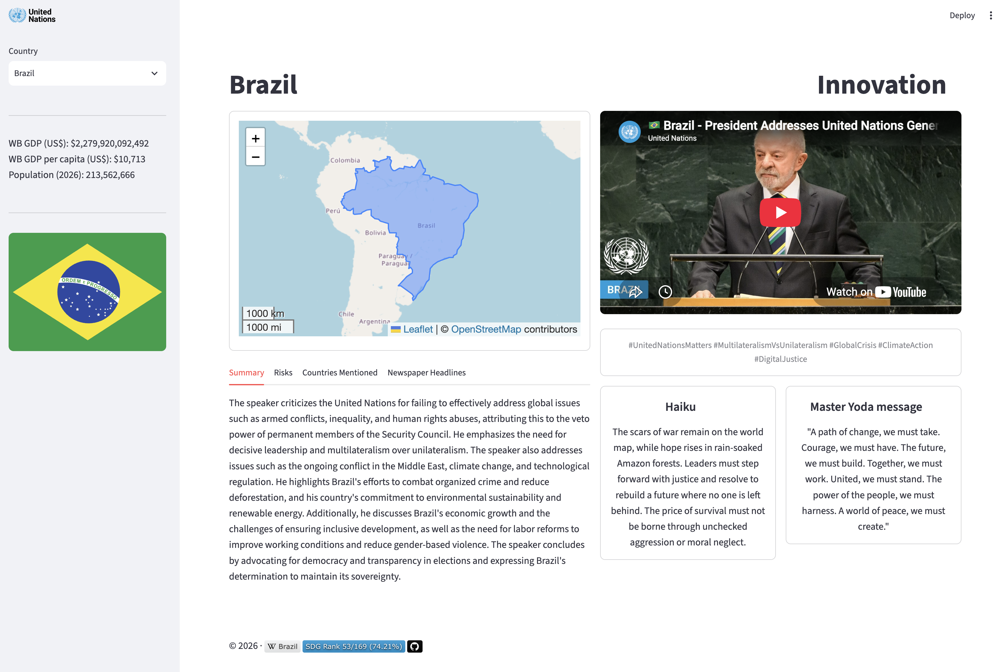

# UN General Assembly #81 - Speeches

[](https://www.un.org)
[](https://www.youtube.com/watch?v=_Wjvf2jJols&list=PLB69IJorxm_g)

Access the [#UNGA81 App](https://unga81.streamlit.app).

Visualization of the speeches at the #UNGA81 between 22 - 28 September, 2026.

This is a personal project with the aim to explore the texts in the speeches 
at the #UNGA81.

The app is a combination of using LLMs to extract information and publicly available datasets.

Screenshot of the streamlit app:



## LLM application

* [x] Summary of the speech
* [x] Summary in one word
* [x] Risks mentioned in the speech
* [x] List of countries mentioned
* [x] A haiku generated from the speech
* [x] Hashtags generated from the speech
* [x] Fictitional newspaper headlines in different styles
* [x] A message from master Yoda

### Prerequisites

This repository requires [`uv`](https://docs.astral.sh/uv/getting-started/installation/) and [Ollama](https://ollama.com) installed.

```bash
curl -fsSL https://ollama.com/install.sh | sh
ollama pull llama3.2
ollama pull qwen2.5:3b
ollama pull qwen3.5:0.8b
ollama pull gemma3:4b
```

### UNGA81 repository

```bash
# Clone this repository
git clone https://github.com/darenasc/unga81.git

# Change directory to repository
cd unga81

# Install dependencies
uv sync

# Run the streamlit app
uv run streamlit run app/app.py

# Download video URLs, transcripts and country information
# uv run unga81
```

## Tools used

- Ollama
- sqlite3
- [Vector data from Natural Earth Data](https://www.naturalearthdata.com)
- [Worldometer.info](https://www.worldometers.info)
- [Sustainable Development Report database](https://dashboards.sdgindex.org/) 

## Data

- [#UNGA81 - United Nations General Assembly - YouTube playlist](https://www.youtube.com/playlist?list=PLB69IJorxm_g)
- [UNGA81 Speech urls](https://docs.google.com/spreadsheets/d/1qtqfnRSW24j-XLN7SRKywDCuFatARCH8pUg1Rr6I2vI/export?format=csv&gid=1802282131)
- [Admin 0 – Countries](https://www.naturalearthdata.com/http//www.naturalearthdata.com/download/110m/cultural/ne_110m_admin_0_countries.zip)
- [Sustainable Development Report - Access full database in Excel](https://dashboards.sdgindex.org/static/downloads/database_2026.xlsx) (accessed 27.09.2026)
- [iso3166-flags](https://github.com/amckenna41/iso3166-flags) (flags)

## Previous years

- [UNGA80](https://unga80.streamlit.app/)
- [UNGA79](https://unga79.streamlit.app/)
- [UNGA78](https://unga-speeches-2023.streamlit.app/)

## Contributing

Create an [issue](https://github.com/darenasc/unga81/issues) with your 
suggestions and recommendations.

## **Disclaimer**

This repository contains a project designed to analyze and process speeches from the United Nations using Large
Language Models (LLMs). The purpose of this project is for entertainment and educational purposes only.

**No Endorsement or Guarantee**

The analysis provided by this project should not be considered as an endorsement or guarantee of the accuracy,
completeness, or reliability of the information contained within. This project is intended to provide a general
overview of speech patterns and trends, but it may not capture the full complexity and nuance of the original
speeches.

**Limitations and Caveats**

* The analysis is based on pre-existing data and models, which may be biased towards certain perspectives or
interpretations.
* The LLMs used in this project are trained on vast amounts of text data, including texts that may contain errors,
inaccuracies, or outdated information.
* This project should not be used for decision-making or policy purposes, as the analysis may not provide a
comprehensive understanding of the complex issues involved.

**No Liability**

The repository author and maintainer make no warranties, express or implied, regarding the accuracy,
completeness, or reliability of the information contained within. By using this project, you acknowledge that you
are using it for personal, non-commercial purposes only.

**Attribution**

By using this project, you agree to hold harmless the repository author and maintainer from any claims or
liabilities arising from the use of this project.